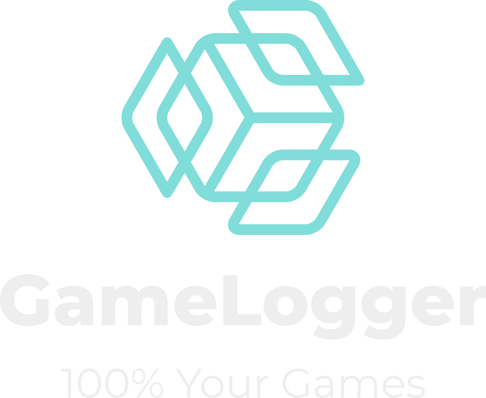

Here's a detailed README for the GameLogger project based on the given description:

---



**GameLogger** is a web application designed to help gamers easily track their game progress and manage a wishlist of games they plan to play. This tool provides an organized way to monitor game completion, maintain a catalog of games, and keep track of upcoming titles.

## 🚀 Features

- 📊 **Track Game Progress**: Record and update your progress for each game, including achievements, levels completed, and playtime.
- 📅 **Wishlist Management**: Maintain a wishlist of games, with release dates and priority rankings.
- 🔍 **Game Filtering & Sorting**: Easily find games by genre, platform, or completion status.
- 🛠️ **Customizable Interface**: Tailor the UI to suit your preferences.

## 🛠️ Tech Stack

- **Frontend**: React, Tailwind CSS
- **Backend**: Node.js, Express
- **Database**: MongoDB
- **Languages**: TypeScript, JavaScript

## 📂 Project Structure

```plaintext
📦 GameLogger
 ┣ 📂 backend
 ┣ 📂 public
 ┣ 📂 src
 ┣ 📜 .gitignore
 ┣ 📜 README.md
 ┗ 📜 package.json
```

## 🚧 Installation & Setup

1. **Clone the repository:**

   ```bash
   git clone https://github.com/alexbessedonato/GameLogger.git
   ```

2. **Navigate to the project directory:**

   ```bash
   cd GameLogger
   ```

3. **Install dependencies:**

   ```bash
   npm install
   ```

4. **Start the application:**

   ```bash
   npm start
   ```

## 📜 License

This project is licensed under the MIT License.

## 🤝 Contributing

Contributions, issues, and feature requests are welcome! Feel free to check the [issues page](https://github.com/alexbessedonato/GameLogger/issues) for more details.

---

Let me know if you'd like to add or modify any sections!
